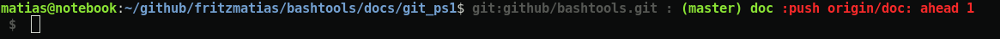

# bashtools
Bash Tools are a set of functions & scripts to help me devolp bash scripts or manage my linux systems

## Dir Structure
 - bashrc.d:     scripts to be loaded from ~/.bashrc
 - bin:          scripts to be executed on demand
 - lib:          functions to be reused by scripts
 - test:         scripts who are able to test the features

## Install
 - `loadpath.sh` reads from ~/.path -one path per line- to create your PATH. Just add in your ~/.bashrc file.
    ```
    . <repo path>/loadpath.sh
    ```
 - add the lib, bin, bashrc.d folders to your PATH

## what is available
### Logging
 a simple bash logging system
 - debug:
 - info:
 - warn:
 - error: returns a no 0 value
 - fatal: finalize the execution with a non 0 value

### Code management
 - import: imports a file accesible form the PATH context and exports all its functions. Also skips to be load more than once 
 - require: forces a variable to be defined
 - assert: validates the execution of a command. Note: some characters, like '"', must be escaped    

### Git 
 repository information on the console prompt like: repo name, current branch, branch parity, sincronization status [more](./docs/git_ps1/README.md)
 - git_ps1 modifies the console prompt. It is better to be loaded in user bashrc

 - what repository/branch are you working on and what branches are included in it.
 

 - when your local repository has push actions pending
 

### ~/.path loader
 - pathloader: adds all the paths on ~/.path to PATH variable. Use it on your ~/.bashrc
